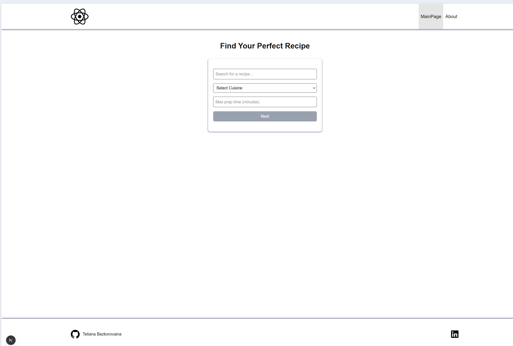
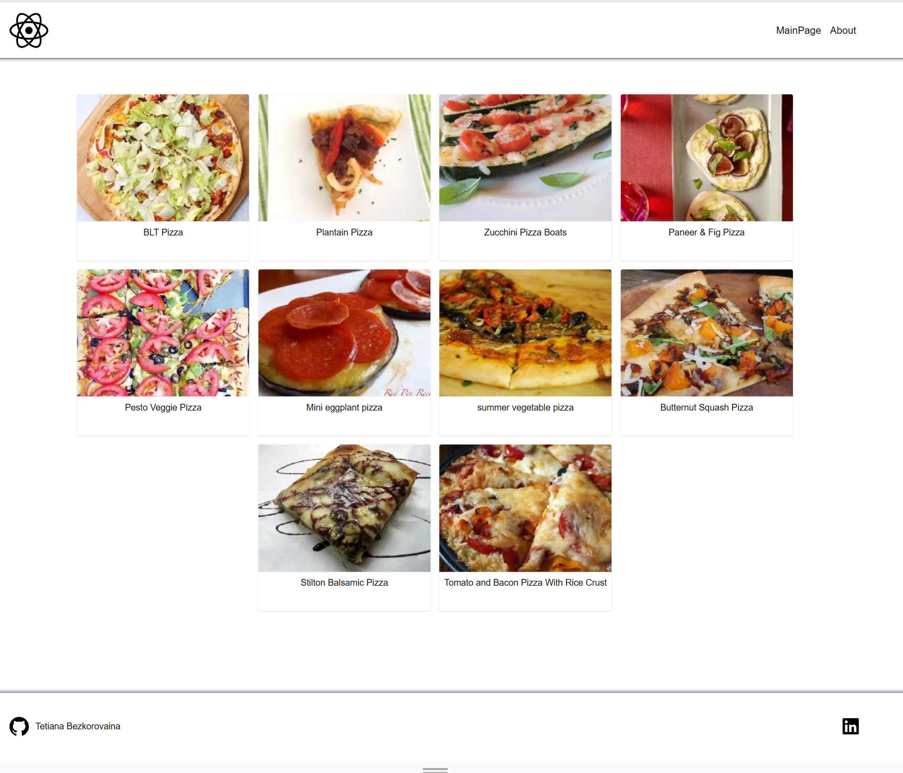
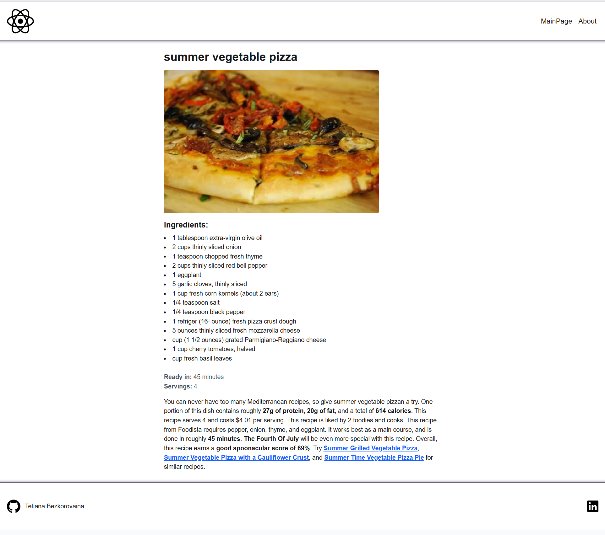

# 🥗 Recipe Finder App

## 📝 Description

**Due to time constraints, the application features a minimalist design, with the main focus on implementing the required functionality.**

A web application that allows users to search for recipes using advanced filters like cuisine type, query keywords, and maximum preparation time. The app fetches data from the Spoonacular API and supports navigation between search results and detailed recipe pages.

## ✨ Key features:

- Search recipes by query, cuisine, or max preparation time
- Filters passed via URL query parameters
- Server-side rendering (SSR) for recipe list and details
- Spinner/Loading indicator added while fetching recipes
- Dynamic routing to individual recipe pages
- Error handling for failed API requests

## 🛠 Technology stack

- Language: [**TypeScript**](https://www.typescriptlang.org/)
- Main library: [**React**](https://react.dev/)
- The React Framework: [**Next.js**](https://nextjs.org/)
- Linters: [**ESLint**](https://eslint.org/), [**Prettier**](https://prettier.io/)
- Styling: [**TailwindCSS**](https://tailwindcss.com/)
- Routing: [**Next.js App Router**](https://nextjs.org/docs/app/building-your-application/routing)
- External API: [**spoonacular API**](https://spoonacular.com/food-api)

## 🌐 API Endpoints Used

Search recipes by query, cuisine, diet, and more.

```
GET /recipes/complexSearch
```

Fetch detailed information for a single recipe, including ingredients and instructions.

```
GET /recipes/{id}/information
```

## ⚙️ Installation

Follow these steps to set up the project locally on your machine.

## 🔑 Prerequisites

Make sure you have [node.js](https://nodejs.org/en), [npm](https://www.npmjs.com/) (Node Package Manager) and [git](https://git-scm.com/) installed on your machine before proceeding with the setup or installation process.
To check if Node.js is installed, you can use the following command:

```
node -v
```

Make sure npm is installed by running

```
npm -v
```

## To get started with this project, follow the steps below:

1. Clone the repository:

```
git clone git@github.com:Tetiana-KET/recipe-finder-app.git
```

2. Install dependencies:

```
npm install
```

3. Set Up Environment Variables

Create a new file named `.env.local` in the root of your project and add the following line, replacing `YOUR_KEY` with **your actual Spoonacular API key**:

```
SPOONACULAR_API_KEY=YOUR_KEY
```

4. Run the development server:

```
npm run dev
```

This will start the application at available port.

## ❓ Support

For any issues or questions, feel free to open an issue or reach out in any way that is comfortable for you.

<div id="badges">
 <a href="https://t.me/Tatiana_1000_Dribnyz" target="_blank">
  
 </a>
 <a href="mailto:belangelphone@gmail.com" target="_blank">
  
 </a>
 <a href="https://discordapp.com/users/674720964143218723" target="_blank">
  
 </a>
 <a href="https://www.linkedin.com/in/tatiana-ket/" target="_blank">
  
 </a>
 <a href="tel:+380507368706" target="_blank">
    
  </a>
</div>

## 📜 Scripts available

### 🚀 Development

To run the project in development mode:

```
npm run dev
```

This will start the Next.js development server with hot reloading at http://localhost:3000.

### 🧱 Build

To build the project for production:

```
npm run build
```

This compiles the application and prepares an optimized production build in the .next/ directory.

### ✅ Linting

To check for TypeScript/JavaScript issues and enforce code style using ESLint:

```
npm run lint
```

This runs next lint on your codebase, targeting files according to your ESLint config.

### 🔧 Start Production Server

To start a local server with the production build (after npm run build):

```
npm run start
```

This uses the .next build output to serve the optimized app locally.

## 🖼️ Visuals




